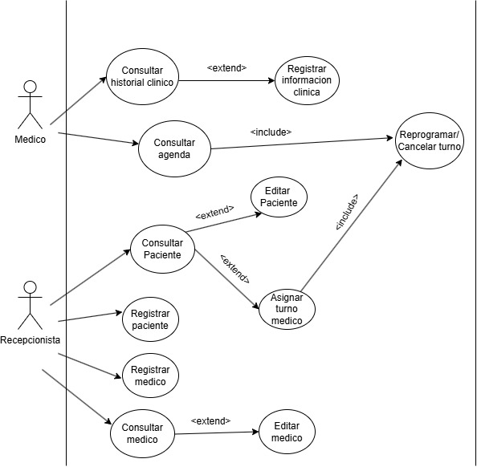

<h1>TP PROGRAMACION AVANZADA</h1>

<h2>📄 Archivos Word</h2>
<ul>
  <li>Un <strong>Entrevista de relevacion de requerimientos</strong></li>
  <li>Un <strong>Especificación de Requisitos de Software (SRS)</strong></li>
</ul>
<ul>
  <li><a href="./Entrevista.docx" download>Entrevista.docx</a></li>
  <li><a href="./SRS.docx" download>SRS.docx</a></li>
</ul>

Este repositorio contiene dos diagramas relacionados con el diseño de una base de datos:

<ul>
  <li>Un <strong>Diagrama Entidad-Relación (DER)</strong></li>
  <li>Un <strong>Diagrama de Clases UML</strong></li>
</ul>

<h2>📊 Diagrama Entidad-Relación (DER)</h2>

<h2>🧩 Diagrama de Clases UML</h2>

<h2>🧩 Diagrama de Casos de uso</h2>

